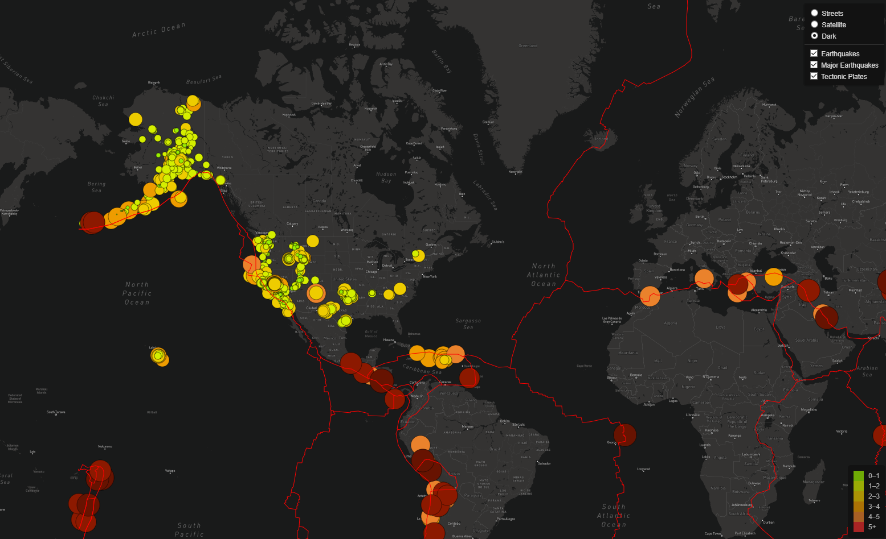

# Mapping Earthquakes

## Project Purpose
Using earthquake data found in GeoJSON format, we will create a visualization of a map that will display all of the earthquakes and we will visually show the differences between earthquakes by changing the radius and color of each marker. Fault lines for tectonic plates will also be overlaid over the map with a similar method. The map will have multiple different styles of map that can be interchanged, and there will be multiple layers of data that can be toggled on or off.

## Resources
- Software: 
	- JavaScript ES6+
	- D3 (Data-Driven Documents)
	- HTML/CSS
	- Leaflet
	
## The HTML page:

This is what users will see when they first open the html page. All earthquake data represented by different colored circle markers with various sizes of radii that reflect the magnitude of the earthquake. The fault lines of the tectonic plates are also layered on top of the map in red. A legend is present on the bottom right that show which magnitudes each color represents. On the top right there is a drop down menu that allows the UI to toggle between the various map customizations and layer options.